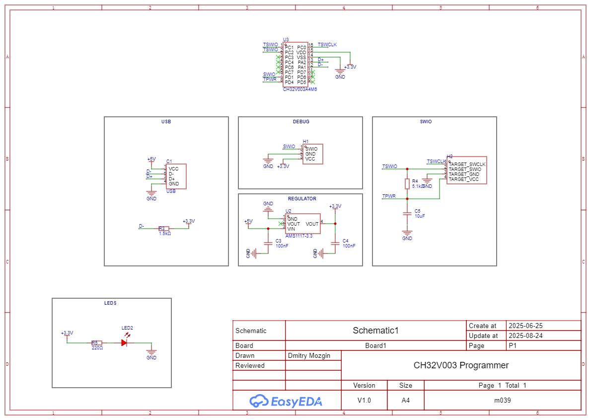

# CH32V003 Programmer

The CH32V003 Programmer was implemented on a single-layer PCB and manufactured using CNC machine. It is based on [rvswdio_programmer](https://github.com/cnlohr/rv003usb/tree/master/rvswdio_programmer).

