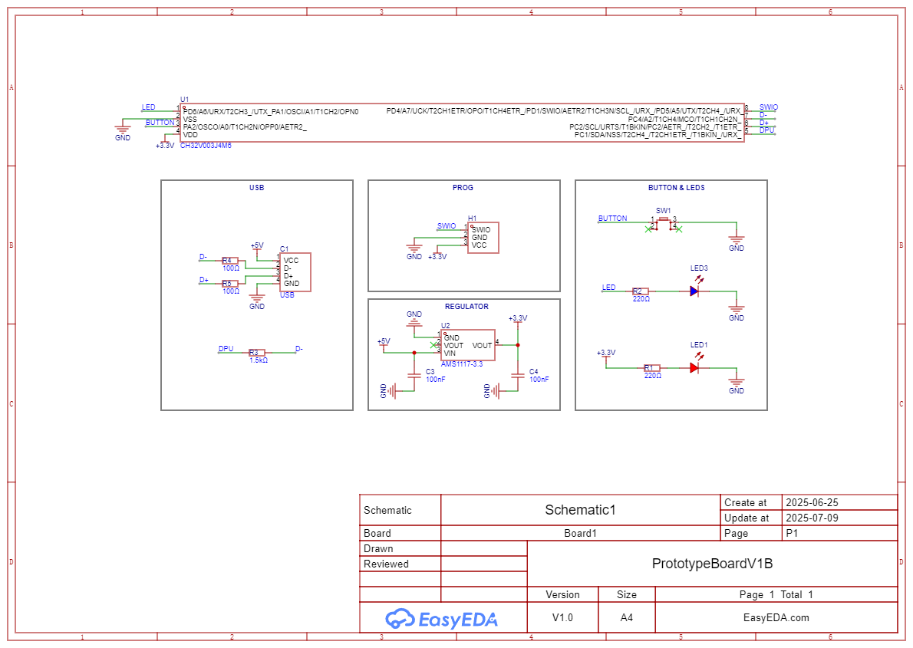
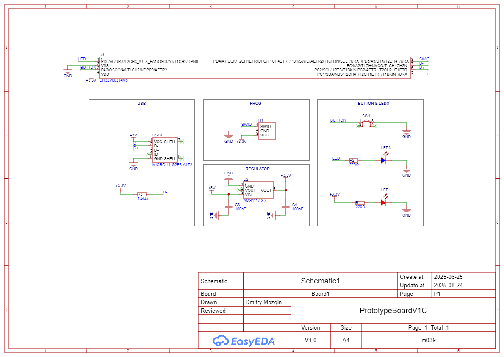

USB boards with one button, and one LED.

# PrototypeBoardV1A (Not Recommended)
No DPU, no D-, D+ resistor.

This board has been tested and has issues with re-enumeration.

# PrototypeBoardV1B (Recommended)
Same as PrototypeBoardV1A, but with DPU, resistors in series on D- and D+.

This board has been tested and works without issues.

# PrototypeBoardV1C (Not Recommended)
Same as PrototypeBoardV1B, but with a Micro-USB connector.

This board has been tested and has issues with re-enumeration.

