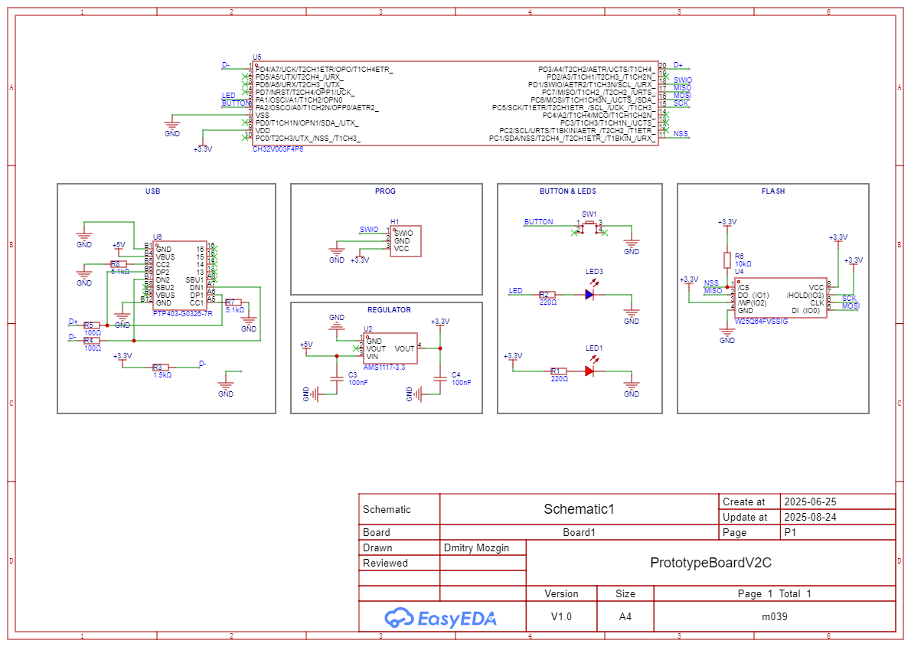

USB boards with one button, one LED, and a SPI Flash chip.

# PrototypeBoardV2A
A board with USB Type-C connector with 4 pins.

# PrototypeBoardV2B
A board with Micro USB connector. (not tested)

# PrototypeBoardV2C
A board with USb Type-C connector with 16 pins. (not tested)

