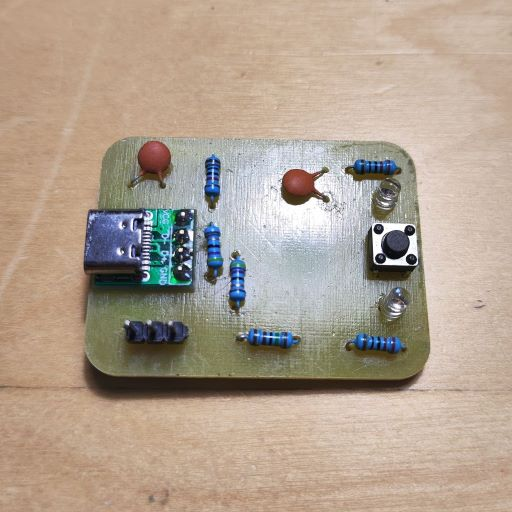
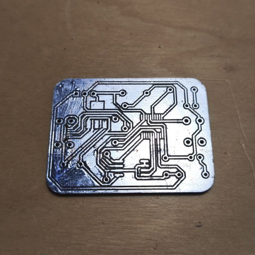
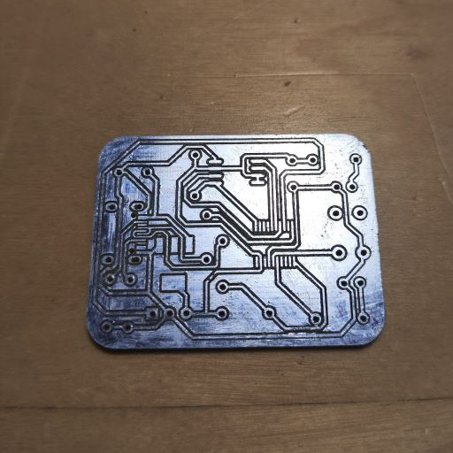

USB boards with one button, one LED, and a SPI Flash chip.

# PrototypeBoardV2A
A board with USB Type-C connector with 4 pins.

This board has been tested, but you should make additional steps for re-enumeration.

# PrototypeBoardV2B (Not tested)
A board with Micro USB connector. 

# PrototypeBoardV2C (Not tested)
A board with USB Type-C connector with 16 pins. 

